# README
### ツール・ライブラリの名前
TECH CAREER
### 簡単な説明
このプロダクトは「キャリアアドバイザーと全生徒がより便利に使える求人システムを作りたい」という想いで作りました。 
通っていたプログラミングスクールで就職斡旋をされていて求職システムがメールにExcelファイルを添付してslackで
キャリアアドバイザーとやりとりをすることに不便さを感じており、他の生徒からもそういった声がありました。 
そこで、私が同期の2人に声をかけ、3人で協力してアジャイル開発をしました。 
使いやすいアプリにするためにUIにもこだわり、チャット機能もついているのでコミュニケーションも取れるようになっています。
### 機能
- トップページで求人一覧が見れる
- キャリアアドバイザー(advisors)の新規登録、ログイン・ログアウト機能
- キャリアアドバイザー(advisors)は生徒一覧の表示と担当の表示
- 生徒(students)の新規登録、プロフィール画像登録、ログイン・ログアウト機能
- 生徒(students)のプロフィール編集機能
- 求人(job)の登録機能
- 求人(job)の編集機能
- 求人(job)の一覧表示、詳細表示
- キャリアアドバイザーと生徒の1対1のチャット機能
### DB設計(ER図)
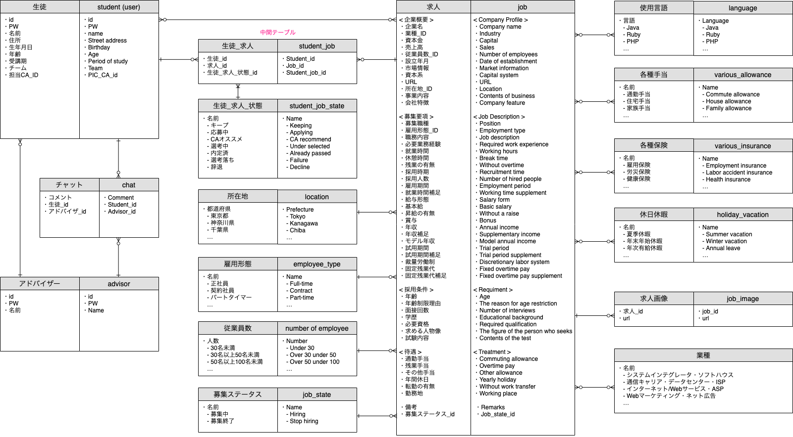
### 開発手法
* 3名でのアジャイル開発
### 使用している技術一覧
* HTML(BEM)
* SASS
* JQuery
* Ruby on Rails
* Carrierwave
* aws
* EC2
* S3
* Mysql
### URL
[URL](http://3.114.151.165/)
※テストアカウントでログインください。
### 使い方
0. トップページで求人一覧が表示されます。
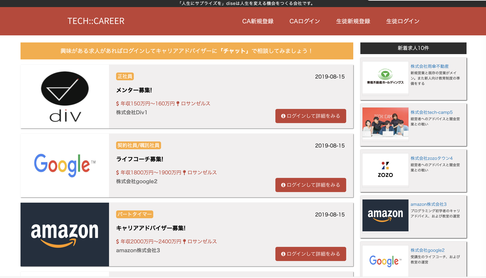
1. トップページのCA新規登録でキャリアアドバイザーを登録することができます。(生徒も同様)
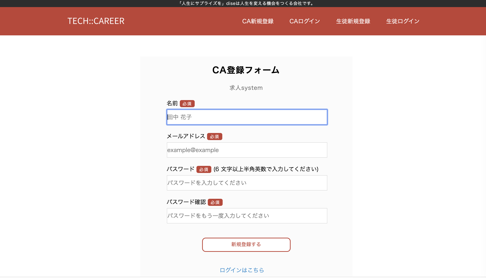
2. トップページのCAログインでキャリアアドバイザーでログインすることができます。(生徒も同様)
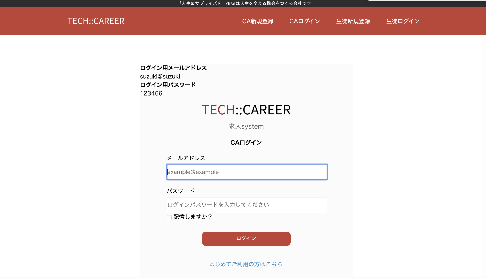
3. キャリアアドバイザーでログイン後、ヘッダーは左から「企業登録」「企業一覧」「生徒一覧」「チャット作成」「チャット一覧」「ログアウト」の順番に並んでいます。
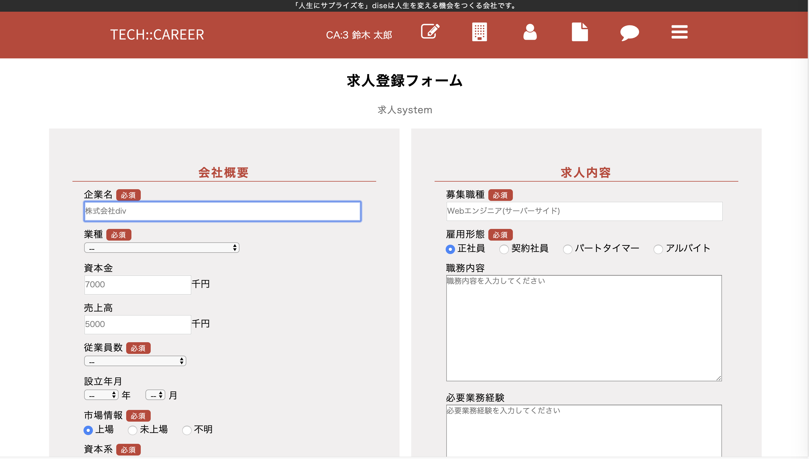
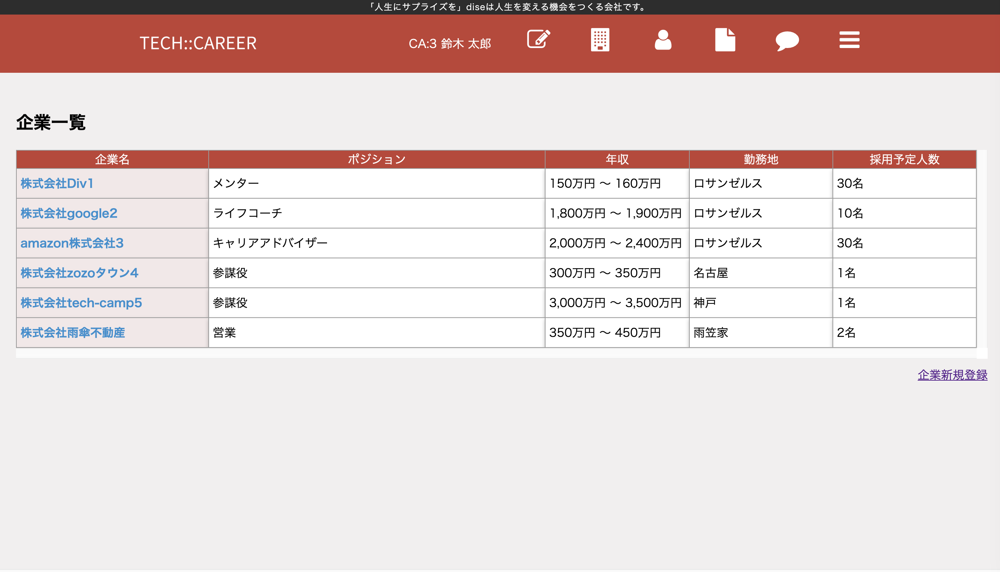
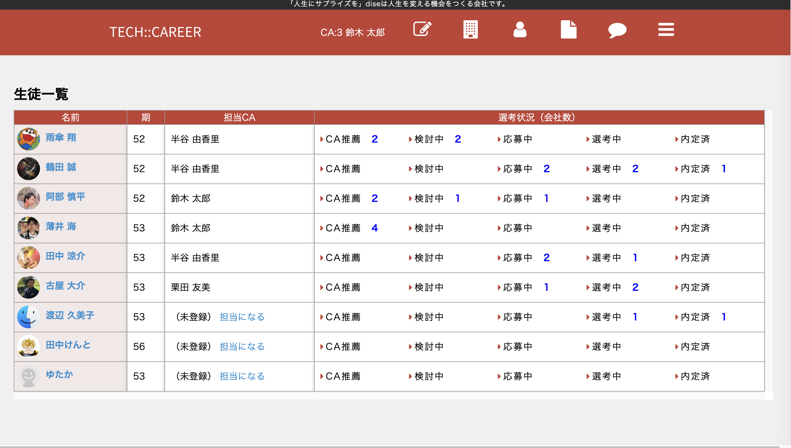
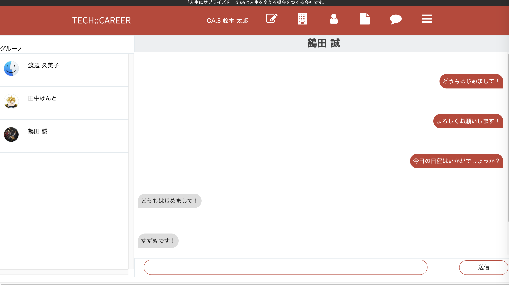
4. 企業一覧の企業名をクリックすると「企業の詳細」と「その企業に対する生徒の選考状況」を表示することができます。
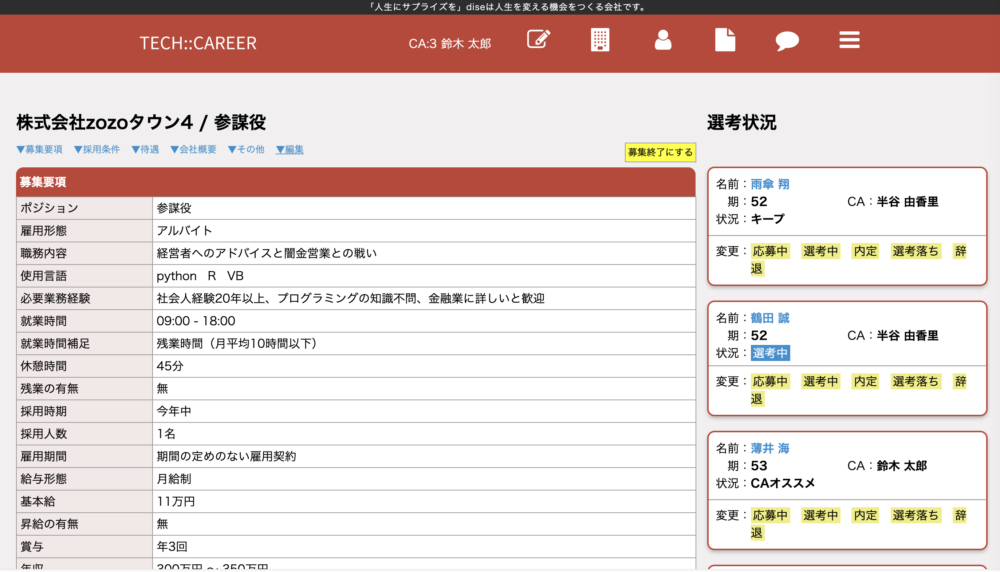
5. 生徒一覧の生徒名をクリックするとその生徒の応募状況が表示できます。
6. チャット作成から生徒を選択しボタンを押すと一覧に生徒が表示され、チャットができるようになります。
7. チャット一覧で現在チャットしている生徒を表示できます。
8. 一番右のボタンでログアウトすることができます。
9. トップページの生徒新規登録で生徒を登録することができます。
10. トップページの生徒ログインで生徒でログインすることができます。
11. 生徒ログイン後生徒情報を編集することができます。
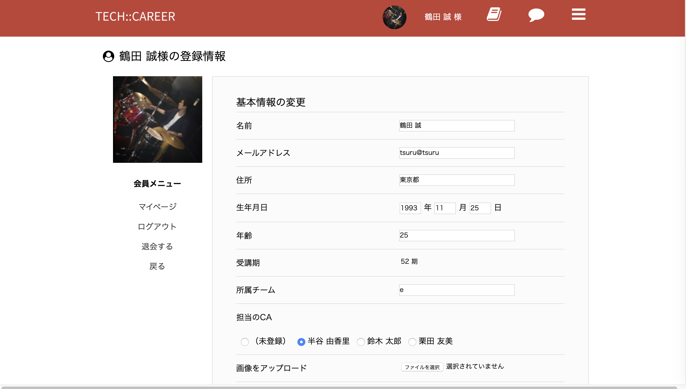
12. 生徒の選考・応募状況の確認変更できます。
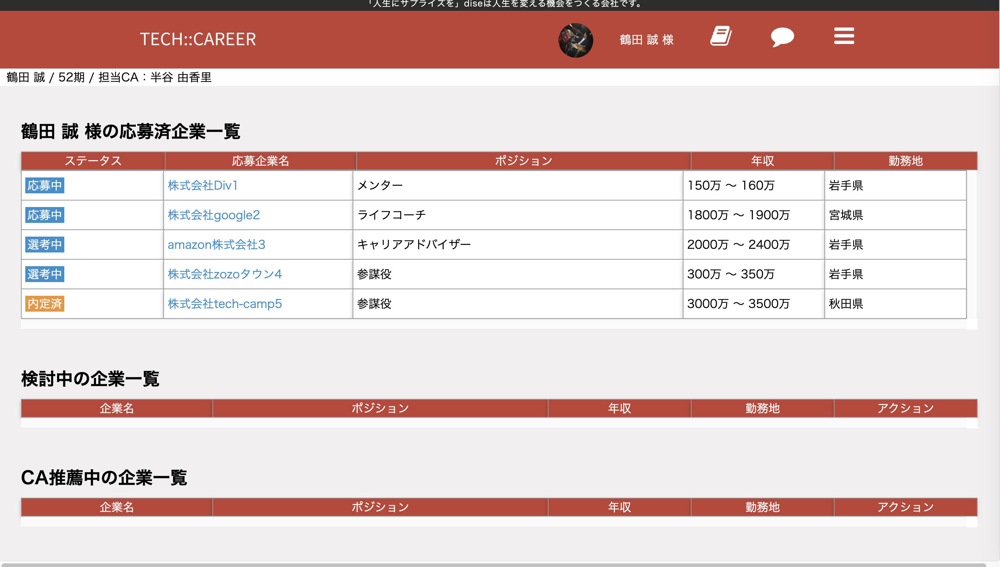
### 作者
[Shinpei Abe](https://shinpei555.github.io) 
